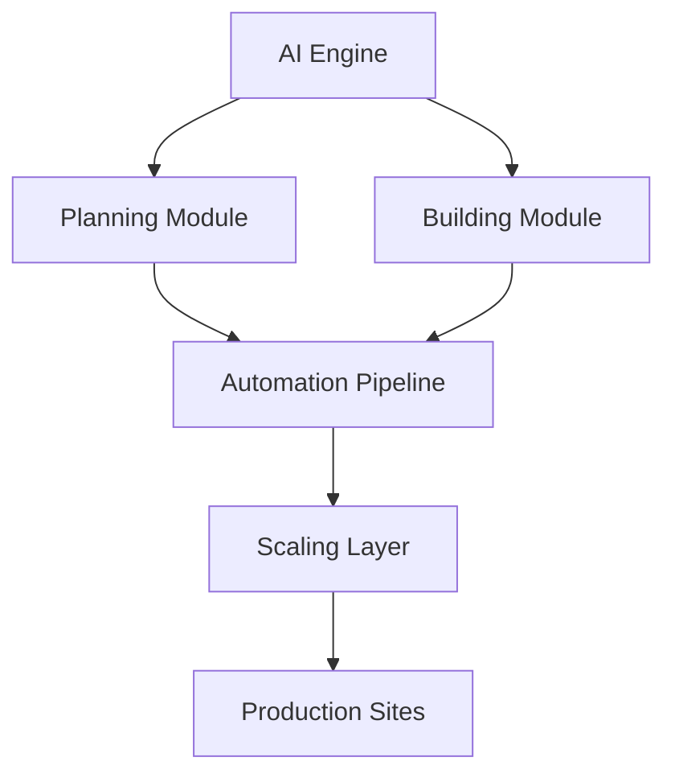

## Overview

SproutOS empowers agencies to plan, build, automate, and scale websites using AI-driven intelligence. You interact with modular components that handle everything from initial planning to production deployment. This page covers the core concepts, including AI planning workflows, building modules, automation mechanisms, and project architecture.

<Callout kind="info">
  Familiarize yourself with these concepts before diving into specific guides. They form the foundation for effective use of SproutOS.
</Callout>

## Key Concepts

Explore the four pillars of SproutOS through these interactive cards.

<Columns cols={2}>
  <Card title="AI Planning Workflows" icon="zap" href="/concepts/planning">
    Use AI to generate project blueprints, sitemaps, and content strategies automatically.
  </Card>
  <Card title="Building Modules" icon="code" href="/concepts/building">
    Assemble customizable components for rapid website construction with drag-and-drop interfaces.
  </Card>
  <Card title="Automation Mechanisms" icon="settings" href="/concepts/automation">
    Automate deployments, testing, and optimizations to streamline your workflow.
  </Card>
  <Card title="Project Architecture" icon="database" href="/concepts/architecture">
    Understand the layered structure that ensures scalability and maintainability.
  </Card>
</Columns>

## Project Architecture Overview

SproutOS follows a modular, layered architecture. The core consists of AI Engine, Module Registry, Automation Pipeline, and Scaling Layer.



This design allows you to extend components independently while maintaining cohesion.

## AI-Powered Planning Workflows

Start projects with AI-driven planning. You input requirements, and SproutOS generates workflows.

<Tabs>
  <Tab title="Basic Workflow" icon="play">
    <Steps>
      <Step title="Define Goals" icon="target">
        Specify project type and audience.
      </Step>
      <Step title="Generate Plan" icon="zap">
        AI creates sitemap and wireframes.
      </Step>
      <Step title="Review & Edit" icon="edit">
        Customize the output interactively.
      </Step>
    </Steps>
  </Tab>
  <Tab title="Advanced Workflow" icon="settings">
    Integrate custom data sources for tailored plans.
  </Tab>
</Tabs>

## Building and Customization Modules

Build sites using pre-built modules. Customize with code when needed.

<CodeGroup tabs="JavaScript,Python">
  ```javascript
  // Import and configure a hero module
  import { HeroModule } from '@sproutos/modules';

  const hero = new HeroModule({
    title: 'Welcome to Your Site',
    image: 'https://example.com/hero.jpg'
  });
  hero.render();
  ```
  ```python
  # Python SDK example for module setup
  from sproutos import Module

  hero = Module('hero', {
      'title': 'Welcome to Your Site',
      'image': 'https://example.com/hero.jpg'
  })
  hero.deploy()
  ```
</CodeGroup>

## Automation and Scaling

Automate repetitive tasks and scale effortlessly. Use webhooks for CI/CD integration.

<Expandable title="Scaling Best Practices" default-open="false">
  Monitor usage with the dashboard at `https://dashboard.example.com`. Set auto-scaling rules to handle traffic spikes exceeding `{1000}` concurrent users.
</Expandable>

<Callout kind="tip">
  Always test automations in staging before production to avoid disruptions.
</Callout>

## Next Steps

<Card title="Quickstart" icon="rocket" href="/quickstart">
  Apply these concepts in a hands-on tutorial.
</Card>

<Card title="Authentication" icon="shield" href="/authentication">
  Secure your SproutOS projects.
</Card>