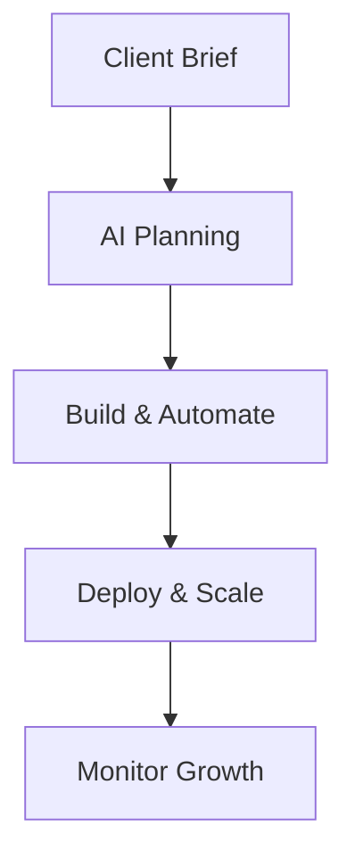

## Overview

SproutOS empowers agencies to plan, build, automate, and scale websites using AI-driven tools. You streamline your workflow from initial client briefs to production deployment, reducing manual effort and accelerating project timelines.

<Image
  src="https://sproutos.ai/SproutOs.png"
  alt="SproutOS interface showing AI planning and building tools"
  width="800"
  height="450"
  style="margin: 0 auto;"
/>

This guide covers the core features with practical examples tailored for agency teams.

## Key Features

<Columns cols={2}>
  <Card title="AI Website Planning" icon="zap" href="#">
    Generate sitemaps, wireframes, and content outlines instantly from client requirements.
  </Card>
  <Card title="Interactive Site Building" icon="code" href="#">
    Build responsive sites with drag-and-drop components and AI-assisted coding.
  </Card>
  <Card title="Task Automation" icon="settings" href="#">
    Automate deployments, testing, and SEO optimizations to free up your team.
  </Card>
  <Card title="Project Scaling" icon="trending-up" href="#">
    Manage multiple clients and grow capacity without proportional team expansion.
  </Card>
</Columns>

## Website Planning with AI

Start projects faster by using SproutOS AI to analyze client briefs and produce structured plans.

<Steps>
  <Step title="Input Client Brief" icon="edit-3">
    Enter requirements like "e-commerce site for fashion brand targeting millennials".
  </Step>
  <Step title="Generate Plan" icon="zap">
    AI creates sitemap, user flows, and content strategy in seconds.
  </Step>
  <Step title="Refine and Export" icon="download">
    Edit collaboratively and export to Figma or your CMS.
  </Step>
</Steps>

<Callout kind="tip">
  Save planning time by 70%—agencies report completing briefs in under 10 minutes.
</Callout>

## Building Interactive Sites

SproutOS lets you assemble interactive components without deep coding expertise.

<Tabs>
  <Tab title="React Components" icon="code">
    Drag pre-built elements like carousels and forms.
````jsx
import { Carousel, FormBuilder } from '@sproutos/ui';

function SiteBuilder() {
  return (
    <div>
      <Carousel images={productImages} />
      <FormBuilder fields={contactFields} />
    </div>
  );
}
````
  </Tab>
  <Tab title="No-Code Builder" icon="mouse-pointer">
    Use visual editor for landing pages.
````html
<div class="hero-section">
  <h1>AI-Powered Websites</h1>
  <button>Start Free Trial</button>
</div>
````
  </Tab>
</Tabs>

## Automating Repetitive Tasks

Eliminate manual work with built-in automations for testing, deployment, and optimizations.

<CodeGroup tabs="JavaScript,Python">
```javascript
// Automate deployment via API
const sprout = require('sproutos-sdk');
await sprout.deploy({
  projectId: 'proj_123',
  branch: 'main',
  env: 'production'
});
```
```python
# Python automation script
from sproutos import SproutOS
client = SproutOS(api_key='YOUR_API_KEY')
client.deploy(project_id='proj_123', branch='main')
```
</CodeGroup>

<Callout kind="info">
  Connect to GitHub for CI/CD pipelines that run on every push.
</Callout>

## Scaling Projects for Growth

As your agency expands, SproutOS handles increased load seamlessly.



<Expandable title="Advanced Scaling Options" default-open="false">

Scale to 100+ concurrent projects:

- Auto-provision resources based on traffic.
- Team collaboration with role-based access.

| Feature | Benefit |
|---------|---------|
| Auto-Scaling | Handles traffic spikes |
| Multi-Team | 10+ users per project |
| Analytics | Real-time performance |

</Expandable>

## Next Steps

<Columns cols={2}>
  <Card title="Quickstart" icon="book-open" href="/quickstart" horizontal>
    Set up your first project in 5 minutes.
  </Card>
  <Card title="Authentication" icon="shield" href="/authentication" horizontal>
    Secure your agency workspace.
  </Card>
</Columns>

<Callout kind="success">
  Ready to transform your agency workflow? Start with the Quickstart guide.
</Callout>